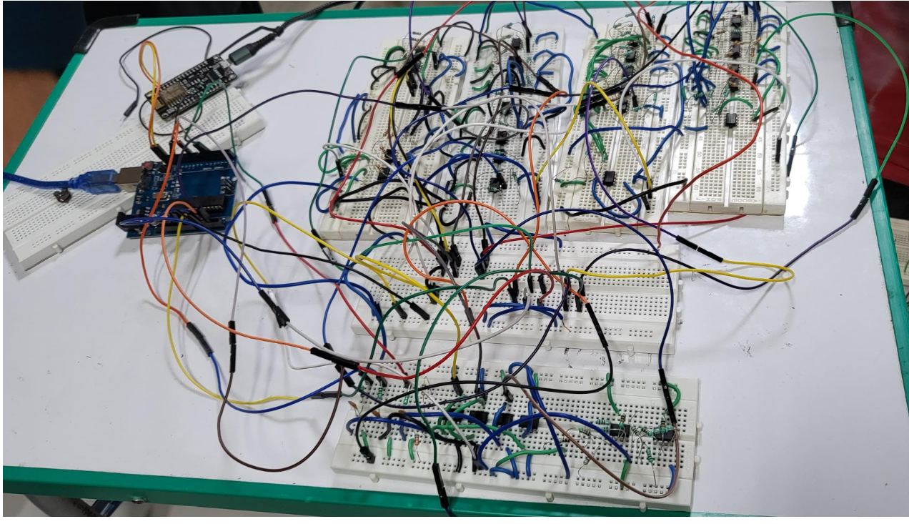

# Precision Analog Calculator

A precision analog calculator capable of addition, subtraction, multiplication and nth-root operations using operational amplifiers, diodes and NodeMCU-based PWM input.

## Features

- **Arithmetic Operations**: Perform addition, subtraction, multiplication, and nth root calculations for numbers ranging from -12 to 12.
- **Parentheses for Grouping**: Support for complex expressions with grouping using parentheses.
- **Wireless Input**: Inputs can be given wirelessly over Wi-Fi connection by phone or laptops handled by NodeMCU unit.
- **Arduino Integration**: Input expressions are parsed and converted for Arduino using the Arduino Stack Library.
- **Inputs via PWM**: PWM square wave is averaged to its DC value by a RC low-pass filter and given to the analog circuit.
- **Display Output**: Calculated results are displayed on the user's personal computer screen.
## How It Works

1. **User Input**: Enter a mathematical expression on a personal computer.
2. **Expression Parsing**: The computer parses the expression into numbers, operators, and parentheses.
3. **Arduino Interface**: Arduino translates the parsed expression for analog circuitry.
4. **Analog Circuitry**: Analog circuitry performs basic arithmetic operations.
5. **Result Display**: The computed result is sent back to the personal computer screen for display.

## Project Files
- adder_subtractor.asc
- multiplier.asc
- nth_root.asc
- scaler_descaler.asc
- nodemcu_pwm.ino
- Project_report.pdf
## Hardware Implementation

The analog calculator was implemented and tested using operational amplifiers, diode-based circuits, resistive networks, and NodeMCU-based PWM input.

### Project Veteran:
Masoom Ali
